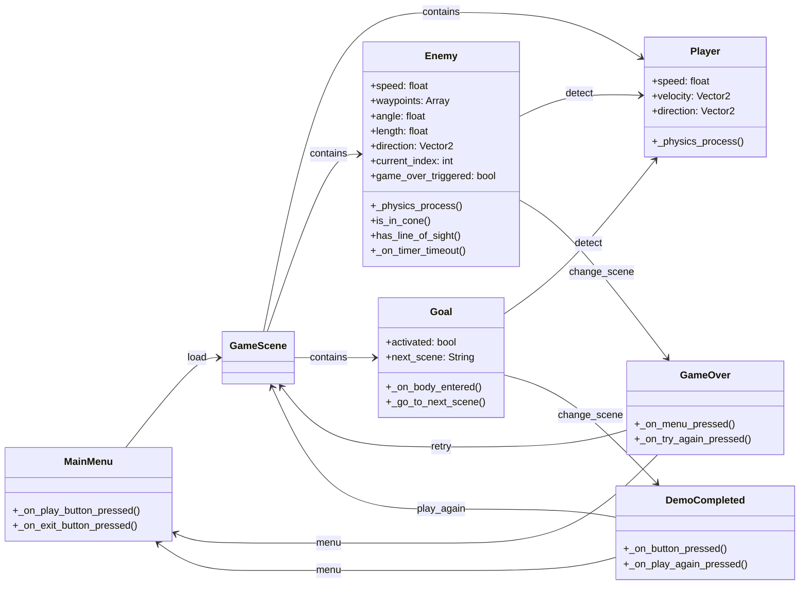

# AST Code & Play

## Descripción del sistema

El proyecto consiste en el diseño y desarrollo de una plataforma de videojuegos orientada al
usuario, que combina un ecosistema de juegos personalizados con una arquitectura que integra
recepción de feedback y soporte técnico, permitiendo que la evolución del catálogo sea
impulsada directamente por la comunidad.

Para esta entrega (Entrega 3 / Sumativa 2), el equipo implementó de forma completa y funcional
la historia de usuario **US-02: Sistema de compras**, que permite a un jugador gastar su
moneda virtual para adquirir objetos (cosméticos, consumibles o de mejora) en una tienda dentro
del juego.

## Historia de usuario implementada

| ID    | Nombre              | Issue |
|-------|---------------------|-------|
| US-02 | Sistema de compras  | [#2](https://github.com/AST-Code-Play/Proyecto-Fundamentos-De-Software/issues/2) |

US-02 integra una **transacción que une dos entidades** (Jugador y Objeto), correspondiente al
alcance mínimo exigido por la pauta de evaluación.

### Otras historias de usuario del proyecto (fuera de alcance de esta entrega)

| ID   | Nombre                          | Issue  |
|------|---------------------------------|--------|
| US-01 | Tutorial didáctico             | [#1](https://github.com/AST-Code-Play/Proyecto-Fundamentos-De-Software/issues/1)   |
| US-03 | Lista de conexiones y estado   | [#3](https://github.com/AST-Code-Play/Proyecto-Fundamentos-De-Software/issues/3)   |
| US-04 | Configuración de accesibilidad | [#4](https://github.com/AST-Code-Play/Proyecto-Fundamentos-De-Software/issues/4)   |
| US-05 | Registro de actividad          | [#5](https://github.com/AST-Code-Play/Proyecto-Fundamentos-De-Software/issues/5)   |
| US-06 | Ver logros                     | [#6](https://github.com/AST-Code-Play/Proyecto-Fundamentos-De-Software/issues/6)   |
| US-07 | Evitar pérdida de progreso     | [#7](https://github.com/AST-Code-Play/Proyecto-Fundamentos-De-Software/issues/7)   |
| US-08 | Precisión de hitboxes          | [#8](https://github.com/AST-Code-Play/Proyecto-Fundamentos-De-Software/issues/8)   |
| US-09 | Visualizar intento previo      | [#9](https://github.com/AST-Code-Play/Proyecto-Fundamentos-De-Software/issues/9)   |
| US-10 | Contador de intentos           | [#10](https://github.com/AST-Code-Play/Proyecto-Fundamentos-De-Software/issues/10) |

## Artefactos del proyecto

| Artefacto                          | Ubicación / enlace                                  |
|------------------------------------|------------------------------------------------------|
| Modelo de dominio (US-02)          | [docs/ModeloDominio_US02.md](./docs/ModeloDominio_US02.md) |
| Modelo de dominio (mecánica de juego) | Sección "Entidades del Dominio" más abajo en este README |
| Diagrama de casos de uso            | [docs/DiagramaCasosDeUso.md](./docs/DiagramaCasosDeUso.md) |
| Especificación de HU                | [docs/EspecificacionHU.md](./docs/EspecificacionHU.md) |
| Diagrama de estados                 | [docs/DiagramaEstados_Transaccion.md](./docs/DiagramaEstados_Transaccion.md) |
| Diagrama de despliegue y comp.      | [docs/DiagramaDespliegueComponentes.md](./docs/DiagramaDespliegueComponentes.md) |
| Diagrama de componentes             | [docs/DiagramaComponentes.md](./docs/DiagramaComponentes.md) |
| Diagrama de secuencia               | [docs/DiagramaSecuencia.md](./docs/DiagramaSecuencia.md) |
| Casos de prueba                     | [docs/CasosDePrueba.md](./docs/CasosDePrueba.md) |
| Deuda técnica / code smells         | [docs/DeudaTecnica.md](./docs/DeudaTecnica.md) |
| Arquitectura (estilo en capas)      | [Arquitectura.md](./Arquitectura.md) |
| Requisitos extrafuncionales         | [ReqExtrafuncionales.md](./ReqExtrafuncionales.md) |
| Especificación spec-driven (bonus)  | [openspecs/us-02-sistema-de-compras.spec.md](./openspecs/us-02-sistema-de-compras.spec.md) |

## Instrucciones de instalación y ejecución

### Requisitos previos

- Node.js 20+
- PostgreSQL 16 (local) **o** Docker + Docker Compose (recomendado)

### Variables de entorno

Backend (`backend/.env`, ver `backend/.env.example`):

```
PGHOST=localhost
PGPORT=5432
PGUSER=postgres
PGPASSWORD=postgres
PGDATABASE=ast_code_play
PORT=3001
```

Frontend (opcional, `frontend/.env`):

```
VITE_API_URL=http://localhost:3001/api
```

### Instalación y ejecución (sin Docker)

1. Crear la base de datos en PostgreSQL: `createdb ast_code_play`
2. Backend:
   ```bash
   cd backend
   cp .env.example .env   # ajustar credenciales si es necesario
   npm install
   npm run db:init        # crea las tablas y carga datos de ejemplo
   npm start               # http://localhost:3001
   ```
3. Frontend (en otra terminal):
   ```bash
   cd frontend
   npm install
   npm run dev             # http://localhost:5173
   ```

### Instalación y ejecución (con Docker)

```bash
docker-compose up --build
```

Esto levanta tres contenedores: `ast-db` (PostgreSQL, con el esquema cargado automáticamente),
`ast-backend` (API en `http://localhost:3001`) y `ast-frontend` (interfaz en
`http://localhost:4173`).

### Ejecutar las pruebas

```bash
cd backend
npm test
```

## Entidades del Dominio (mecánica de juego — heredado de entrega anterior)


<details>
<summary>Ver código fuente del diagrama (Mermaid)</summary>



</details>

> Nota: este modelo corresponde a la mecánica de juego (plataformas/sigilo) y es independiente
> del modelo de dominio de US-02 (ver [docs/ModeloDominio_US02.md](./docs/ModeloDominio_US02.md)).

## Mockups

| Mockup | Historia de usuario relacionada |
|--------|----------------------------------|
| [Prototipo en Figma](https://www.figma.com/design/bwICFC1WD77lRQX0Z2WnyY/Splinter-Gear-Liquid-X?node-id=0-1&p=f&t=U9F0MKpkNRh91lEm-0) | US-01 al US-10 |

Ver [Archivo ZIP del juego](https://drive.google.com/file/d/1vOnuNOZdk9rHsPeoO6IZqY0eES7on1QN/view)

## Diseño Arquitectónico

Ver [Arquitectura.md](./Arquitectura.md)

## Responsabilidades del equipo

| Integrante | Rol(es) | Ítems de la rúbrica a cargo |
|------------|---------|------------------------------|
| Bruno Mora | Product Owner | [completar] |
| Cristobal Cartagena | Scrum Master | [completar] |
| Jesus Cortes | Developer | [completar] |

> **Importante:** completar esta tabla con los roles reales asignados (Scrum Master,
> Arquitecto, Technical Lead, Developer, Quality Assurance) antes del cierre de la entrega —
> es obligatoria para la evaluación individual (sección 5.8 de la pauta).

## Bonus

- **Contenedores:** sí — `docker-compose.yml` en la raíz, con separación en 3 contenedores
  (base de datos + backend + frontend).
- **Spec-driven development:** sí — especificación en
  [openspecs/us-02-sistema-de-compras.spec.md](./openspecs/us-02-sistema-de-compras.spec.md).
