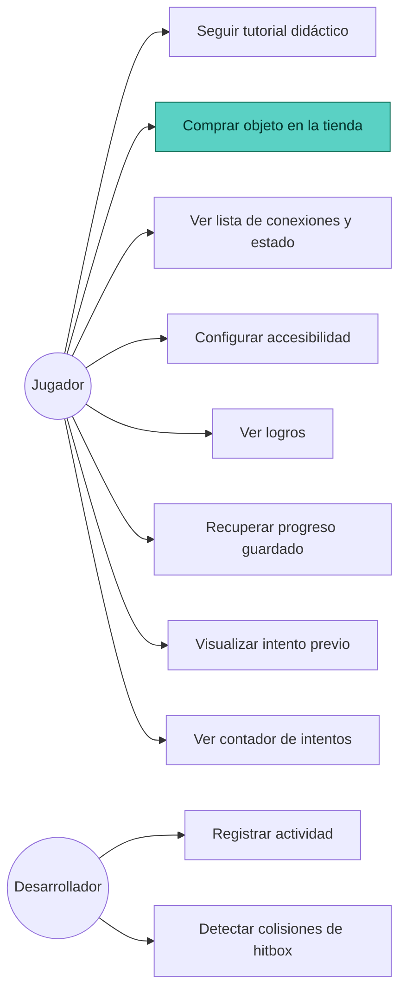

# Diagrama de Casos de Uso

Cubre todas las historias de usuario definidas en el README del proyecto. La que está
**implementada y en alcance de esta entrega** es US-02 (Sistema de compras); el resto se
muestra para mantener trazabilidad con el modelo de dominio general, pero no forma parte del
desarrollo evaluado en esta Entrega 3 (ver sección 3 de la pauta — "no está incluido en esta
evaluación").

Ver código fuente del diagrama (Mermaid)

**Caso de uso en alcance de esta entrega: UC2 — Comprar objeto en la tienda**, resaltado en el
diagrama, corresponde a US-02 y se describe en detalle en `EspecificacionHU.md`.
