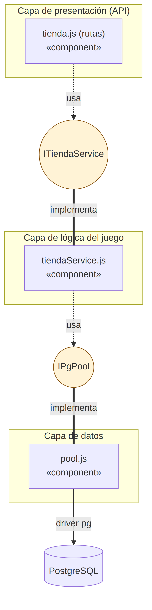
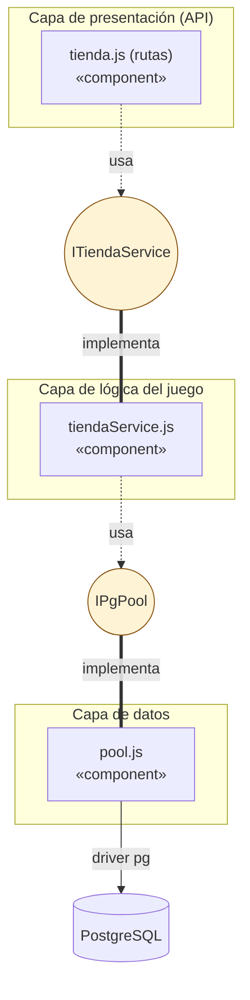

# Diagrama de Componentes (dependencias e interfaces)

A diferencia del diagrama de despliegue (que muestra nodos físicos/contenedores), este
diagrama muestra los **componentes de software** dentro del backend y sus interfaces
explícitas, siguiendo la arquitectura en capas definida en `Arquitectura.md`.

Ver código fuente del diagrama (Mermaid)

**Interfaces explícitas:**

- **`ITiendaService`**: expone `obtenerCatalogo()`, `obtenerJugador(id)`,
  `obtenerInventario(id)` y `comprarObjeto(jugadorId, objetoId)`. Es el contrato que la capa de
  presentación (`tienda.js`) consume sin conocer detalles de SQL ni de PostgreSQL —
  dependencia hacia la capa de lógica, nunca al revés.
- **`IPgPool`**: el pool de conexiones (`pool.js`) expone `query(sql, params)`. La capa de
  lógica depende de esta interfaz para ejecutar transacciones (`BEGIN`/`COMMIT`/`ROLLBACK`),
  sin que la capa de presentación tenga acceso directo a la base de datos.

Esta separación es la que permite, según `Arquitectura.md`, modificar las reglas de negocio de
la tienda (por ejemplo, agregar descuentos) sin tocar las rutas HTTP, y migrar de PostgreSQL a
otro motor sin tocar `tiendaService.js`.
