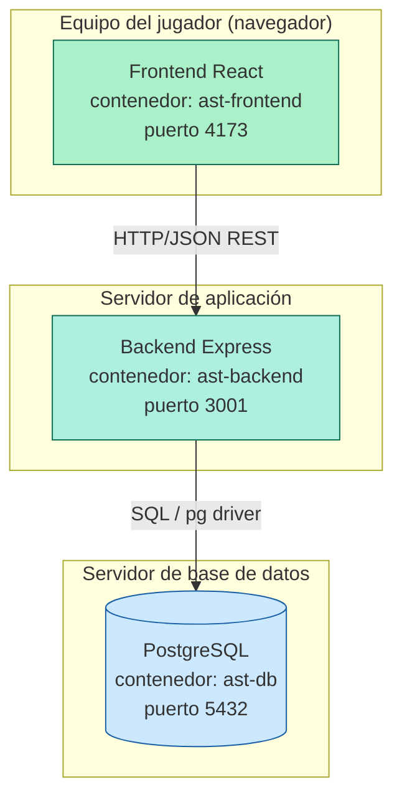

# Diagrama de Despliegue y Componentes

Ver código fuente del diagrama (Mermaid)

Los tres componentes se despliegan como contenedores Docker independientes, orquestados por
`docker-compose.yml` en la raíz del repositorio (bonus de contenedores, sección 5.7). En un
entorno sin Docker, los tres procesos se ejecutan localmente: Postgres como servicio del
sistema, y backend/frontend con Node.js (ver instrucciones en el README).
