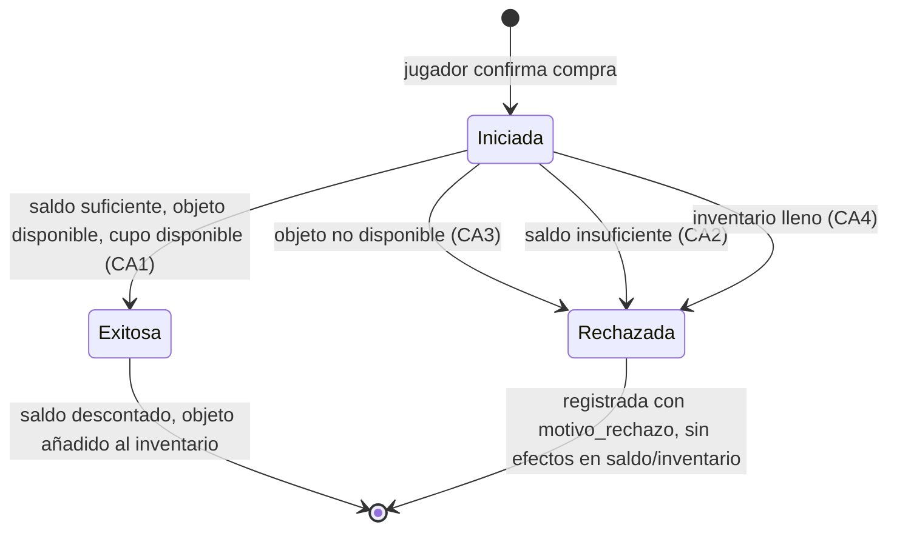

# Diagrama de Estados — Entidad Transacción

Modela el ciclo de vida de una `Transaccion` de compra, desde que el jugador confirma la
intención de compra hasta su resultado final. Cada transición corresponde a una de las
validaciones de negocio (CA1–CA4) implementadas en `tiendaService.js`.

Ver código fuente del diagrama (Mermaid)

**Correspondencia con el código:** las transiciones se evalúan en orden dentro de
`comprarObjeto()` (`backend/src/services/tiendaService.js`): primero disponibilidad del
objeto, luego saldo, luego cupo de inventario. El estado final (`Exitosa` o `Rechazada`) queda
persistido en la tabla `transacciones`, incluyendo el motivo de rechazo cuando aplica — esto
permite reconstruir el historial completo de intentos de compra de un jugador.
