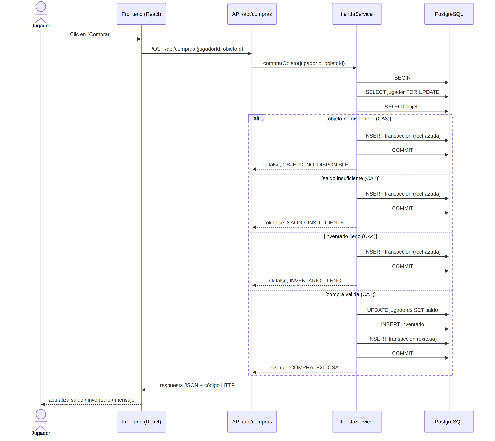
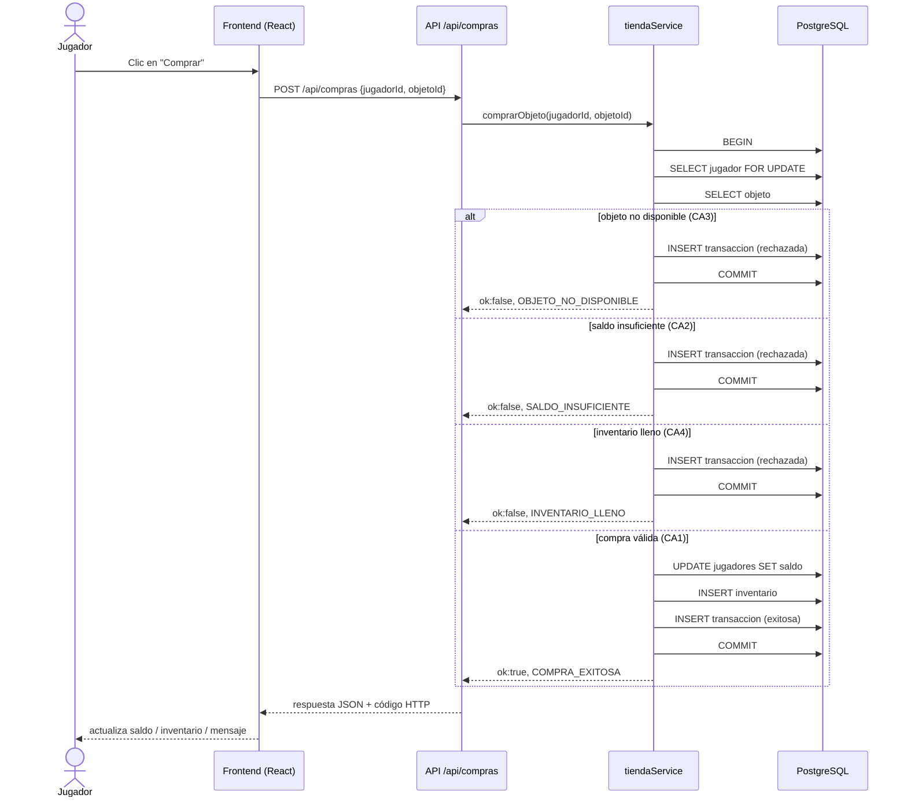

# Diagrama de Secuencia — Compra de un objeto (US-02)

Muestra el flujo completo de una compra desde la interfaz hasta la base de datos, incluyendo
el camino exitoso (CA1) y los puntos de corte donde se activan los rechazos (CA2–CA4).

Ver código fuente del diagrama (Mermaid)

**Nota de consistencia:** todas las ramas (éxito o rechazo) pasan por una única transacción SQL
(`BEGIN`...`COMMIT`), lo que evita condiciones de carrera si dos compras del mismo jugador
llegan simultáneamente (el `SELECT ... FOR UPDATE` bloquea la fila del jugador mientras se
evalúan las reglas de negocio).
