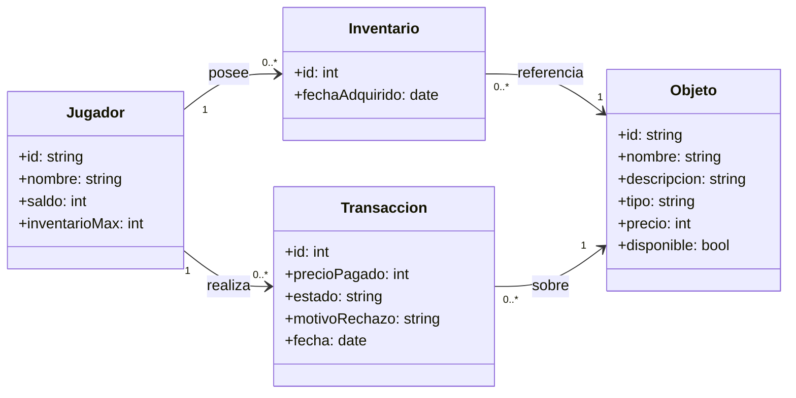

# Modelo de Dominio — US-02: Sistema de compras

Este modelo de dominio corresponde específicamente a la historia de usuario implementada en
esta entrega (US-02). El modelo de dominio de la mecánica de juego (Player, Enemy, GameScene,
etc., descrito en el README original) corresponde a otra parte del sistema y se mantiene sin
cambios.

Ver código fuente del diagrama (Mermaid)

**Notas de diseño:**

- `Inventario` es la entidad asociativa entre `Jugador` y `Objeto` (relación N:M): cada fila
  representa "este jugador posee este objeto".
- `Transaccion` es la entidad que materializa la **transacción que une 2+ entidades** exigida
  por la pauta: registra cada intento de compra (exitoso o rechazado) con su jugador, objeto,
  precio pagado y motivo de rechazo si corresponde.
- `Objeto.disponible` controla si el objeto puede comprarse (CA3). `Jugador.saldo` y
  `Jugador.inventarioMax` son los límites que activan CA2 y CA4 respectivamente.
